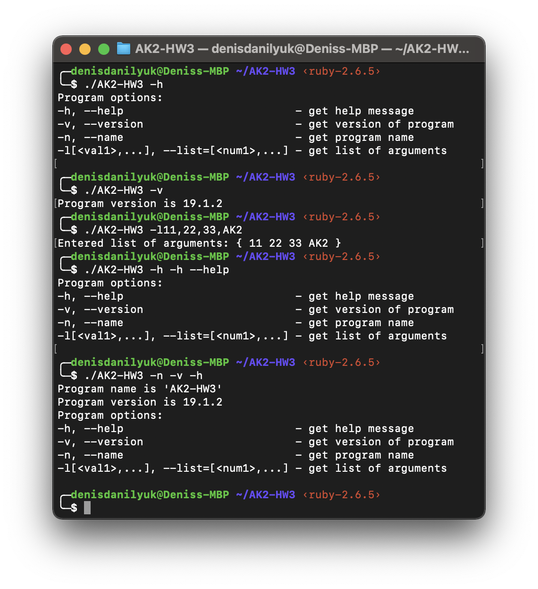

#AK2-HW3

#### Program options:

​	-h, --help                         		- get help message
​	-v, --version                   		- get version of program
​	-n, --name                       		- get program name
​	-l[<val1>,...], --list=[<num1>,...]     - get list of arguments\n"

#### Program screenshots:

